# ConsultaMed — Gestión hospitalaria y citas médicas

Aplicación web **Django** (MVT) para agendar citas, administrar pacientes y médicos, historias clínicas básicas, horarios de disponibilidad, panel con **Chart.js**, exportación **PDF/Excel** y confirmación de citas por **correo** (en desarrollo se usa el backend de consola).

## Objetivo del proyecto

Diseñar e implementar un sistema que permita **coordinar la atención ambulatoria** entre administración, recepción (operador), médicos y pacientes: registro controlado de usuarios, agenda con validación de disponibilidad, historial clínico básico, constancias y certificados asociados a citas, y paneles de indicadores para la gestión institucional.

**Alcance funcional resumido:** autenticación por roles, CRUD de entidades clave, reportes descargables, interfaz responsiva y lineamientos de despliegue en plataforma gratuita (Render / Railway / PythonAnywhere).

## Repositorio y versionamiento

- **Repositorio GitHub:** [https://github.com/davidluna301/Gestion_Hospital](https://github.com/davidluna301/Gestion_Hospital)
- **Rama de integración del equipo:** `develop` (trabajo diario y merges de características).
- **Política:** no realizar commits directos a **`main`** salvo acuerdo explícito del dueño del repositorio (p. ej. release).
- **Guía detallada de ramas, PR y convención de commits:** ver [`docs/VERSIONAMIENTO_Y_RAMAS.md`](docs/VERSIONAMIENTO_Y_RAMAS.md).

## Equipo de desarrollo (UCC)

| Integrante | Usuario GitHub     | Correo campus |
|-------------|--------------------|---------------|
| Dev1 (repo) | davidluna301       | david.lunamar@campusucc.edu.co |
| Dev2        | Vanessaucc         | julieth.mena@campusucc.edu.co |
| Dev3        | valeriaucc         | valeria.gongora@campusucc.edu.co |
| Dev4        | BurbanoValentina   | valentina.burbanos@campusucc.edu.co |

Cada persona crea su rama `feature/devN-...` desde `develop` actualizado, sube commits descriptivos en español y abre **Pull Request** hacia `develop`. Las ramas de característica **no se borran** tras el merge (evidencia académica).

## Requisitos

- Python 3.12+ (probado con 3.14)
- `pip` / entorno virtual recomendado

## Instalación local

```bash
cd <carpeta-del-repositorio>   # raíz donde está manage.py
python -m venv .venv
.venv\Scripts\activate          # Windows
# source .venv/bin/activate     # Linux / macOS
python -m pip install -r requirements.txt
python manage.py migrate
python manage.py seed_demo    # datos y usuarios de prueba (opcional)
python manage.py runserver
```

Abra `http://127.0.0.1:8000/` para la **landing** e inicio de sesión. El panel autenticado está en `/panel/`.

> **Altas:** el administrador da de alta médicos en **Médicos → Nuevo**. El operador da de alta pacientes en **Pacientes → Nuevo**. Hace falta al menos una **especialidad** (cree en `/admin/` o ejecute `seed_demo`).

### Usuarios de prueba

Ver el archivo **`CREDENCIALES_PRUEBA.txt`** (generado tras `seed_demo`).

## Diagrama ER — cuatro modelos principales (llaves foráneas)

Los cuatro modelos de negocio que articulan el núcleo de la agenda son **`Specialty`**, **`Doctor`**, **`Patient`** y **`Appointment`**. Las relaciones por clave foránea son:

| Origen | Campo / relación | Destino |
|--------|-------------------|---------|
| `Doctor` | `especialidad_id` (FK) | `Specialty` |
| `Appointment` | `medico_id` (FK) | `Doctor` |
| `Appointment` | `paciente_id` (FK) | `Patient` |
| `Doctor` | `usuario_id` (OneToOne) | `accounts.User` |
| `Patient` | `usuario_id` (OneToOne) | `accounts.User` |

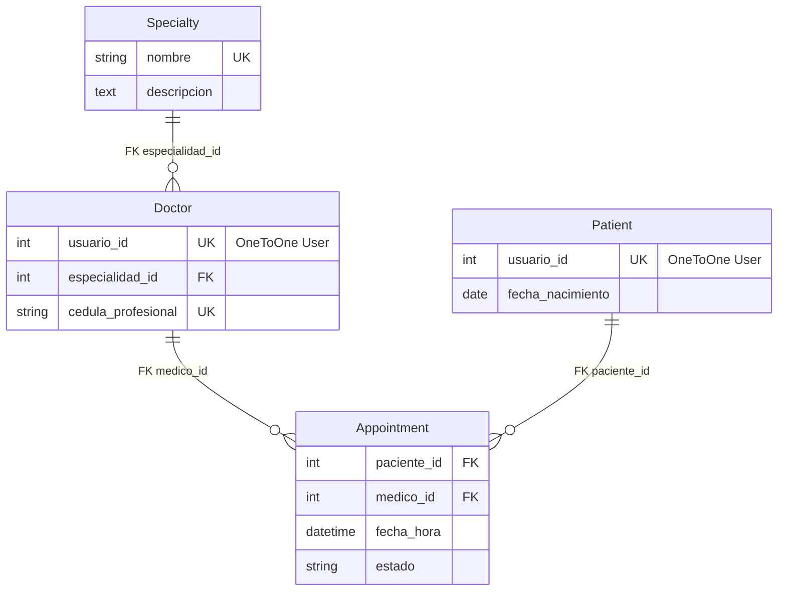

Una **cita** (`Appointment`) siempre referencia a un **paciente** y a un **médico**; el médico pertenece a una **especialidad**. Los perfiles `Doctor` y `Patient` enlazan cada persona con su cuenta `User`.

## Modelos adicionales (contexto)

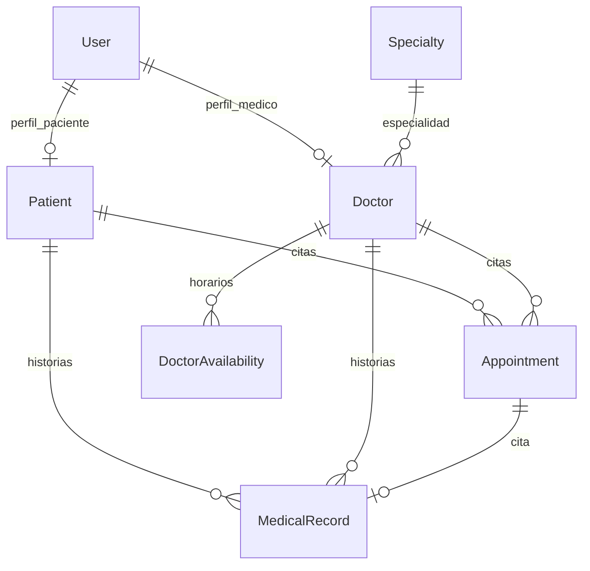

| Modelo | Descripción |
|--------|-------------|
| `accounts.User` | Usuario con `email` único y `role`: ADMIN, OPERADOR, MEDICO, PACIENTE. |
| `Specialty` | Especialidad médica. |
| `Doctor` | Perfil médico (OneToOne a `User`, FK a `Specialty`). |
| `Patient` | Perfil paciente (OneToOne a `User`). |
| `Appointment` | Cita (FK paciente, médico; solapamiento; `certificado` y `certificado_notas` opcionales). |
| `DoctorAvailability` | Franjas recurrentes por día de la semana. |
| `MedicalRecord` | Historia clínica (FK paciente, médico; cita opcional). |

## Rutas principales (aplicación web)

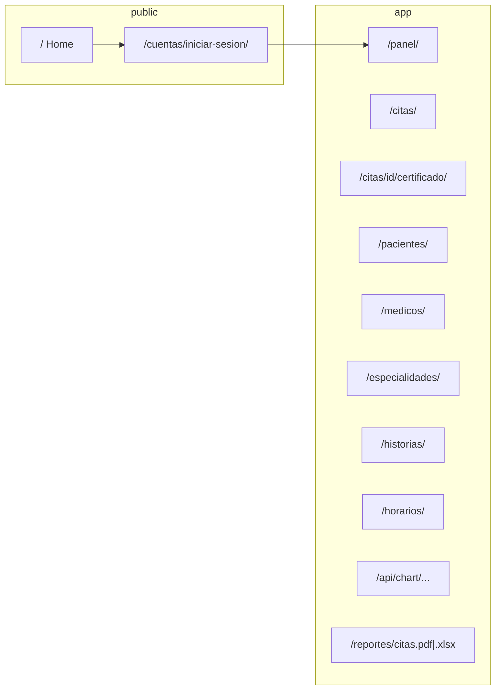

| Ruta | Uso |
|------|-----|
| `/` | Landing e inicio de sesión (sin registro público). |
| `/cuentas/iniciar-sesion/` | Login por correo. |
| `/panel/` | Dashboard según rol (gráficos solo administrador). |
| `/citas/` | Listado con filtros; el paciente solo ve sus citas y acciones de constancia/certificado. |
| `/citas/<id>/certificado/` | Adjuntar PDF/imagen y notas del certificado (paciente, cita confirmada o completada). |
| `/citas/<id>/constancia.pdf` | Descarga de constancia en PDF generada desde los datos de la cita (paciente). |
| `/pacientes/` | Lista y buscador; **alta de paciente** solo rol **Operador** (`/pacientes/nuevo/`). |
| `/medicos/`, `/especialidades/` | CRUD reservado a **administrador**; **alta de médico** en `/medicos/nuevo/`. |
| `/historias/` | CRUD de historia clínica (médico y admin). |
| `/horarios/` | Disponibilidad por médico (médico y admin). |
| `/api/chart/citas-especialidad/`, `/api/chart/pacientes-mes/` | JSON para Chart.js (admin). |
| `/reportes/citas.pdf`, `/reportes/citas.xlsx` | Exportación (admin, médico y operador). |
| `/admin/` | Django Admin (usuarios activos/inactivos, filtros en citas, etc.). |

## Roles y permisos (resumen)

- **Administrador:** panel con gráficos, especialidades, médicos, listado de pacientes (edición completa incl. usuario en formulario), reportes y horarios; **alta de médicos** solo en `/medicos/nuevo/`. Para **alta de pacientes** en la app web use un usuario **Operador** o cree el paciente en `/admin/`.
- **Operador (atención / recepción):** citas de todo el sistema, exportaciones, listado y **alta de pacientes** en `/pacientes/nuevo/`; edición de datos demográficos del paciente (sin cambiar el usuario vinculado); **no** accede a historias clínicas ni horarios.
- **Médico:** sus citas, horarios propios, historias donde figure como médico, exportaciones; puede eliminar sus citas.
- **Paciente:** solo sus citas (consulta y **nueva cita** con validación de disponibilidad); **no** edita citas en el formulario general; puede **descargar constancia PDF** y **adjuntar certificado** en citas confirmadas o completadas; ve su historia clínica y su perfil desde el panel.

## Despliegue en producción

La interfaz (Bootstrap + plantillas Django) y el backend se despliegan en **un solo servicio web**; la base de datos es **PostgreSQL** enlazada con `DATABASE_URL`.

**Guía paso a paso (Render, checklist, correo, media):** [`docs/DESPLIEGUE.md`](docs/DESPLIEGUE.md)

**Despliegue rápido en Render:** conectar el repo en **New → Blueprint** usando [`render.yaml`](render.yaml) (crea Web Service + PostgreSQL + disco para certificados).

Resumen:

1. Variables mínimas: `DJANGO_SECRET_KEY`, `DJANGO_DEBUG=False`, `DATABASE_URL` (ver [`.env.example`](.env.example)).
2. Build: `pip install -r requirements.txt && python manage.py collectstatic --noinput && python manage.py migrate --noinput`
3. Start: `gunicorn hospital_gestion.wsgi:application --bind 0.0.0.0:$PORT`
4. Tras el primer deploy: `python manage.py createsuperuser` en la Shell de Render.
5. Health check: `/health/`

## Correo electrónico

Al pasar una cita a estado **Confirmada**, se envía un correo a paciente y médico. En local, `EMAIL_BACKEND` apunta a consola (`settings.py`). En producción configure SMTP u otro backend según su proveedor.

## Interfaz

- **Bootstrap 5** y **Bootstrap Icons** (iconografía sin depender de emojis como iconos principales).
- Tema en colores claros con acento **#0E1F53** (`static/css/theme.css`).
- Formularios con **django-crispy-forms** y paquete **crispy-bootstrap5**.

## Estructura del proyecto

```
.
├── accounts/          # Usuario personalizado y autenticación web
├── capturas/          # Evidencias gráficas (UI local, Git Graph)
├── consultas/         # Modelos de dominio, vistas, reportes, señales
├── docs/              # Guía de versionamiento y documentación de equipo
├── hospital_gestion/  # settings, urls, wsgi
├── templates/
├── static/
├── media/             # generado en ejecución (certificados; no versionar binarios)
├── requirements.txt
├── CREDENCIALES_PRUEBA.txt
└── README.md
```

## Evidencia de ejecución local (`runserver`)

Tras `migrate`, `seed_demo` y `python manage.py runserver`, la aplicación queda disponible en `http://127.0.0.1:8000/`. Las capturas siguientes documentan **vistas** públicas y del panel con usuario **administrador** (`admin@consultamed.local`), mostrando navegación por citas, especialidades, médicos, pacientes, historias clínicas y horarios (funcionalidades expuestas en `consultas/urls.py` y vistas asociadas).

| Vista / función | Captura |
|-----------------|--------|
| Landing (`/`) | 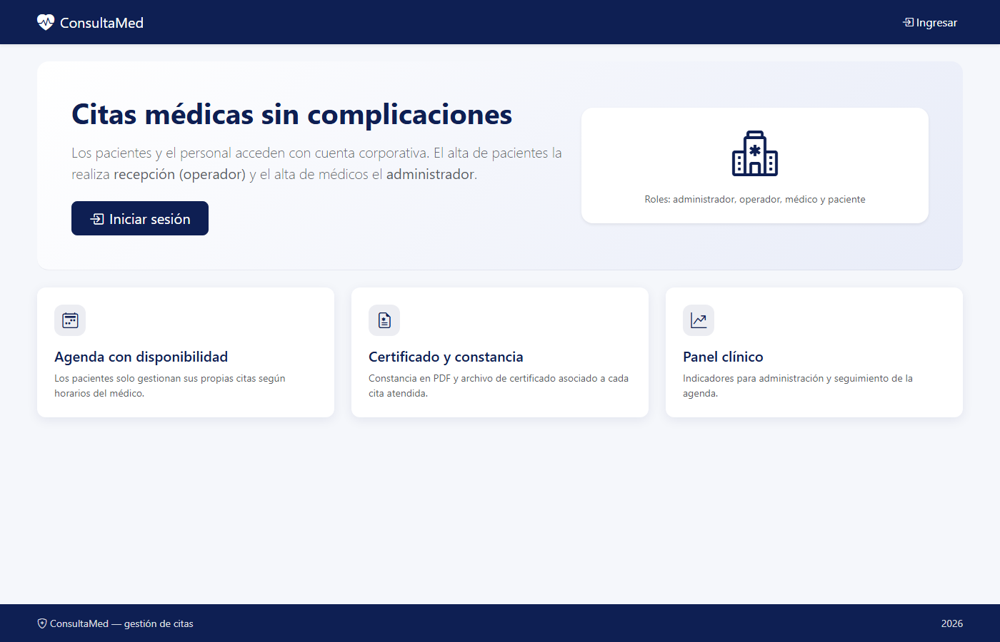 |
| Inicio de sesión (`/cuentas/iniciar-sesion/`) | 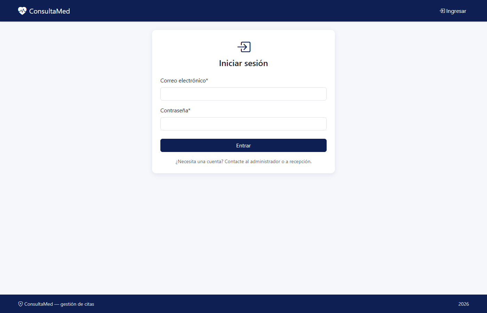 |
| Panel administrador con gráficos (`/panel/`) | 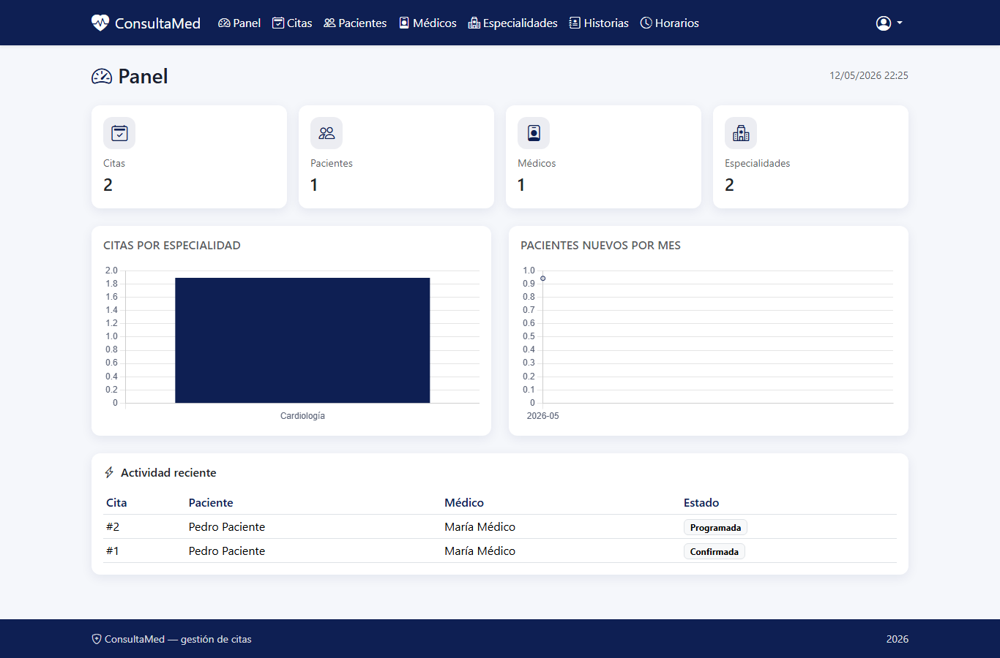 |
| Listado de citas (`/citas/`) | 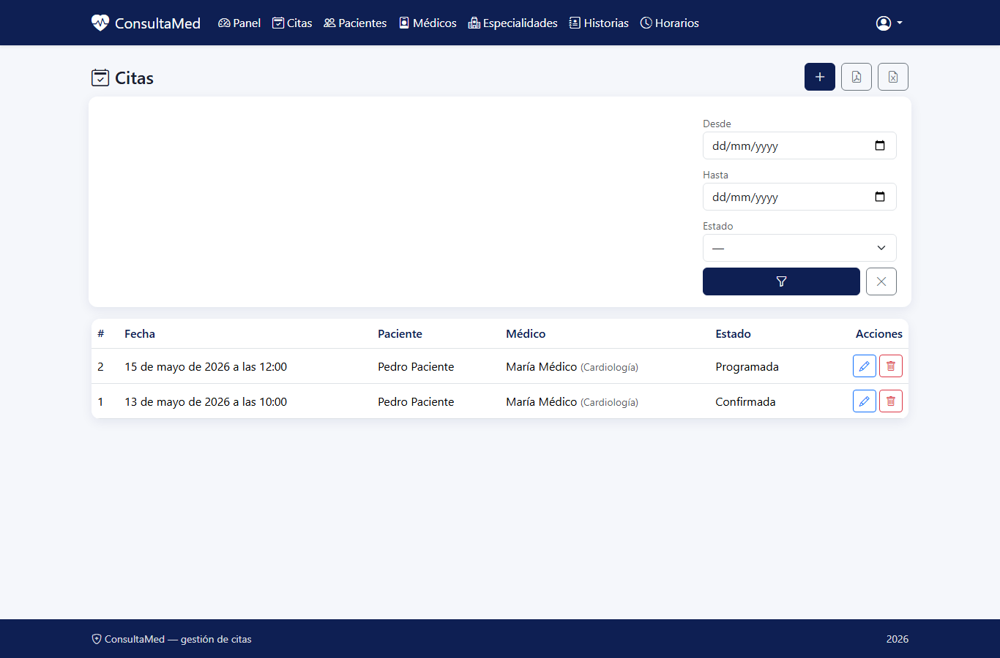 |
| Especialidades (`/especialidades/`) | 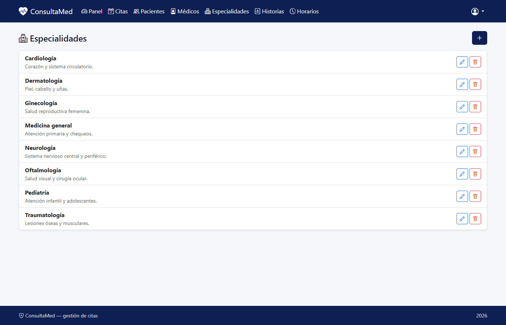 |
| Médicos (`/medicos/`) | 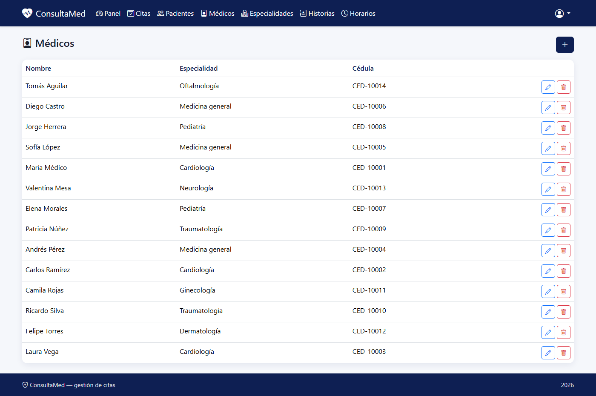 |
| Pacientes (`/pacientes/`) | 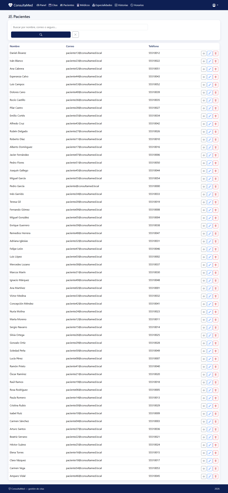 |
| Historias clínicas (`/historias/`) | 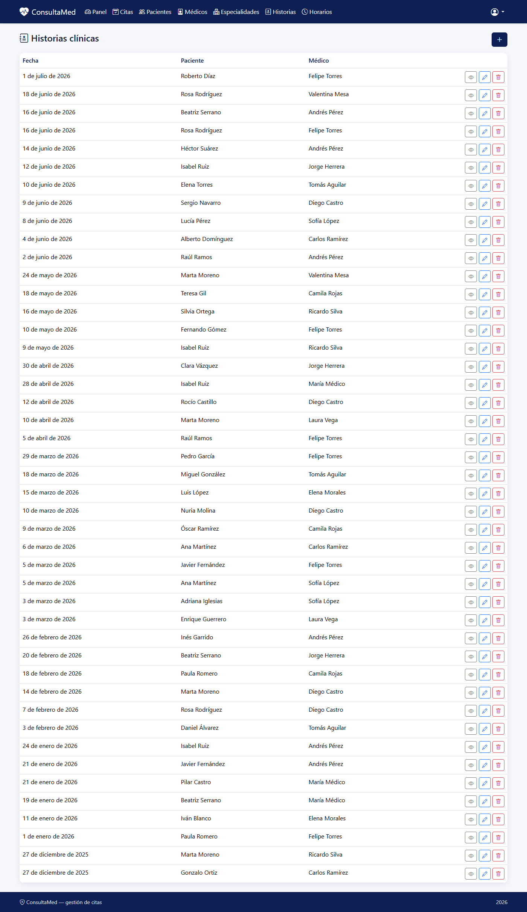 |
| Horarios de disponibilidad (`/horarios/`) | 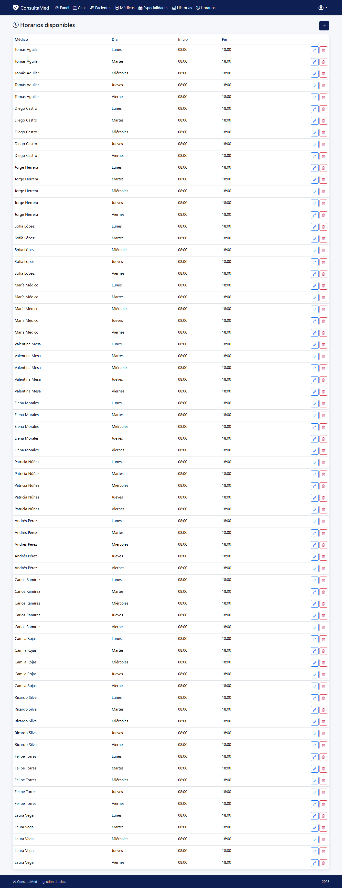 |

## Evidencia de historial en Git (Git Graph)

Vista del grafo de ramas y commits en el IDE (herramienta Git Graph u homóloga), mostrando integración en `develop` y ramas de característica del equipo.

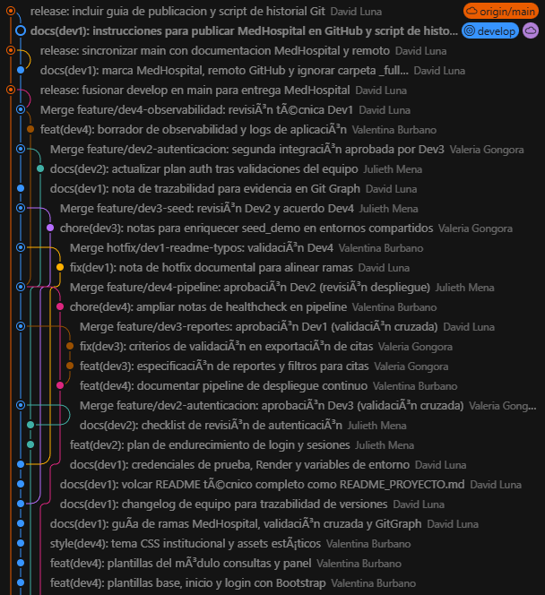

## Trazabilidad en Git

El flujo de ramas, validación cruzada entre desarrolladores antes de integrar en `develop`, nombres de integrantes y convención de mensajes de commit se documenta en [`docs/VERSIONAMIENTO_Y_RAMAS.md`](docs/VERSIONAMIENTO_Y_RAMAS.md). El historial en `develop` debe mostrar aportes **repartidos** entre los cuatro desarrolladores.

## Licencia

Proyecto académico de ejemplo; adáptelo según las necesidades de su institución.
