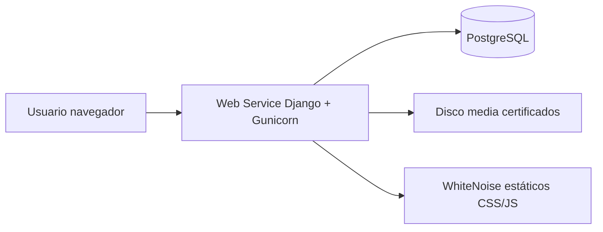

# Despliegue en producción — ConsultaMed

Guía para dejar la aplicación **completamente funcional** en internet: interfaz web, API de gráficos, base de datos PostgreSQL y archivos subidos (certificados).

## Arquitectura (importante)

Este proyecto **no tiene un frontend separado** (no hay React, Vue ni Angular). La “interfaz” es **Django MVT**:

| Componente | Qué es | Dónde se despliega |
|------------|--------|-------------------|
| **Interfaz (UI)** | Plantillas HTML + Bootstrap 5 + Chart.js | Mismo **Web Service** que el backend |
| **Backend / API** | Vistas Django, reportes PDF/Excel, JSON para gráficos | Mismo **Web Service** |
| **Base de datos** | PostgreSQL (usuarios, citas, historias, etc.) | **PostgreSQL** en Render (u otro proveedor) |
| **Archivos media** | Certificados PDF/imagen subidos por pacientes | Disco persistente en el Web Service |

La conexión **base de datos ↔ aplicación** se hace con la variable de entorno **`DATABASE_URL`**. Django la lee en `hospital_gestion/settings.py` mediante `dj-database-url`. No hay que “conectar el front” manualmente: al desplegar un solo servicio web con `DATABASE_URL`, todo queda enlazado.



## Opción recomendada: Render.com (Blueprint)

El repositorio incluye [`render.yaml`](../render.yaml) para crear en un paso el **Web Service** y la **base de datos**.

### Requisitos

1. Cuenta en [Render](https://render.com) (plan gratuito sirve para pruebas académicas).
2. Repositorio en GitHub: [davidluna301/MedHospital](https://github.com/davidluna301/MedHospital), rama **`develop`** con los últimos cambios (incluido `render.yaml` y ajustes de `settings.py`).
3. Subir a GitHub los commits de despliegue si aún no están en `develop`.

### Pasos en Render

1. **Dashboard** → **New** → **Blueprint**.
2. Conectar GitHub y elegir el repositorio **MedHospital**.
3. Render detecta `render.yaml`. Revisar:
   - **Web Service:** `consultamed` (Python, Gunicorn).
   - **Database:** `consultamed-db` (PostgreSQL).
4. **Apply** y esperar el primer deploy (build: `pip install`, `collectstatic`, `migrate`).
5. Cuando termine, abrir la URL pública, por ejemplo:  
   `https://consultamed-xxxx.onrender.com`

Render define automáticamente:

- `DATABASE_URL` → enlazada a `consultamed-db`
- `RENDER_EXTERNAL_HOSTNAME` → se añade a `ALLOWED_HOSTS` y `CSRF_TRUSTED_ORIGINS`
- `DJANGO_SECRET_KEY` → generada por Render

### Variable opcional en el panel

| Variable | Cuándo configurarla |
|----------|---------------------|
| `DJANGO_ALLOWED_HOSTS` | Solo si usa **dominio propio** además de `*.onrender.com`. Ejemplo: `mi-dominio.com,.onrender.com` |

En la mayoría de despliegues solo en Render **no hace falta** tocar `DJANGO_ALLOWED_HOSTS`.

### Crear el primer administrador (obligatorio en producción)

El comando `seed_demo` es para **desarrollo local** (contraseñas públicas en `CREDENCIALES_PRUEBA.txt`). En producción use una de estas opciones:

**A) Superusuario (recomendado)**

1. Render → servicio **consultamed** → **Shell**.
2. Ejecutar:

```bash
python manage.py createsuperuser
```

3. Asignar correo, nombre y contraseña **fuertes**.
4. En `/admin/` o con un usuario `role=ADMIN` en la app, gestionar el resto.

**B) Datos de demostración (solo entrega académica / demo)**

```bash
python manage.py seed_demo
```

Solo si la base está vacía. **No** usar las contraseñas de `CREDENCIALES_PRUEBA.txt` en un entorno real.

### Comprobar que todo funciona

| Prueba | URL / acción |
|--------|----------------|
| Health check | `https://SU-URL/health/` → debe responder `ok` |
| Landing | `/` |
| Login | `/cuentas/iniciar-sesion/` |
| Panel | `/panel/` (tras login admin) |
| Citas, pacientes, médicos | Rutas del menú según rol |
| Gráficos admin | Panel con Chart.js (requiere usuario ADMIN) |
| Reportes | `/reportes/citas.pdf` y `.xlsx` |
| Certificado paciente | Cita confirmada → adjuntar archivo → enlace de descarga en `media/` |

### Correo en producción (confirmación de citas)

Por defecto en local el correo va a **consola**. En producción configure SMTP en el Web Service:

| Variable | Ejemplo |
|----------|---------|
| `EMAIL_BACKEND` | `django.core.mail.backends.smtp.EmailBackend` |
| `EMAIL_HOST` | `smtp.gmail.com` o SMTP de su proveedor |
| `EMAIL_PORT` | `587` |
| `EMAIL_USE_TLS` | `True` |
| `EMAIL_HOST_USER` | cuenta remitente |
| `EMAIL_HOST_PASSWORD` | contraseña de aplicación |
| `DEFAULT_FROM_EMAIL` | `ConsultaMed <noreply@su-dominio.com>` |

Sin SMTP, el resto de la app funciona; solo fallará el envío al confirmar citas.

### Archivos subidos (certificados) y disco persistente

En el **plan gratuito** de Render el sistema de archivos del Web Service es **efímero**: los certificados en `media/` pueden perderse al **reiniciar o redesplegar**. El resto de la app (citas, usuarios, PDF generados al vuelo) sigue en PostgreSQL y funciona con normalidad.

Para **conservar certificados** entre despliegues:

1. Pase el Web Service a un plan **de pago** (p. ej. Starter).
2. En el panel → **Disks** → añada disco montado en `/opt/render/project/src/media` (1 GB suele bastar).
3. O descomente el bloque `disk` en [`render.yaml`](../render.yaml) y vuelva a desplegar el Blueprint.

## Despliegue manual en Render (sin Blueprint)

1. **New** → **PostgreSQL** → nombre `consultamed-db` → crear.
2. Copiar **Internal Database URL** (o External si aplica).
3. **New** → **Web Service** → mismo repo, rama `develop`, runtime **Python**.
4. **Build Command:**

```bash
pip install -r requirements.txt && python manage.py collectstatic --noinput && python manage.py migrate --noinput
```

5. **Start Command:**

```bash
gunicorn hospital_gestion.wsgi:application --bind 0.0.0.0:$PORT
```

6. **Environment variables:**

| Clave | Valor |
|-------|--------|
| `DJANGO_SECRET_KEY` | cadena larga aleatoria |
| `DJANGO_DEBUG` | `False` |
| `DATABASE_URL` | URL de PostgreSQL del paso 2 |
| `SERVE_MEDIA` | `True` |

7. **Disk** → Mount path: `/opt/render/project/src/media`, 1 GB.
8. **Health Check Path:** `/health/`
9. Deploy → **Shell** → `createsuperuser`.

## Railway (alternativa breve)

1. Proyecto nuevo desde GitHub.
2. Añadir plugin **PostgreSQL** → Railway expone `DATABASE_URL`.
3. Servicio web: comando de inicio igual que Gunicorn arriba; build con `collectstatic` + `migrate`.
4. Variables: `DJANGO_DEBUG=False`, `DJANGO_SECRET_KEY=...`.
5. Railway suele exponer dominio público; añadir ese host en `DJANGO_ALLOWED_HOSTS` y `https://ese-host` en `CSRF_TRUSTED_ORIGINS`.

## PythonAnywhere

1. Subir código o clonar repo.
2. Crear base MySQL o PostgreSQL (según plan); ajustar `DATABASE_URL`.
3. Configurar WSGI apuntando a `hospital_gestion.wsgi`.
4. `collectstatic` y mapear `/static/` en el panel; para `media/` usar enlace o almacenamiento externo.

## Variables de entorno (referencia)

Ver [`.env.example`](../.env.example). Mínimas en producción:

```env
DJANGO_SECRET_KEY=<generar-clave-larga>
DJANGO_DEBUG=False
DATABASE_URL=postgres://...
```

Opcionales: correo SMTP, `DJANGO_ALLOWED_HOSTS`, `CSRF_TRUSTED_ORIGINS`, `MEDIA_ROOT`, `SERVE_MEDIA`.

## Limitaciones del plan gratuito Render

- El servicio web **se duerme** tras inactividad; la primera visita puede tardar ~30–60 s.
- PostgreSQL free tiene **caducidad / límites** según política de Render; revisar el panel.
- **Sin disco persistente** en free: certificados adjuntos pueden borrarse al redeploy (ver sección anterior).
- No usar `seed_demo` ni contraseñas de prueba en un entorno real.

## Resolución de problemas

| Síntoma | Causa probable | Solución |
|---------|----------------|----------|
| `DisallowedHost` | Host no listado | En Render suele bastar con redeploy; o añadir dominio en `DJANGO_ALLOWED_HOSTS` |
| 403 CSRF al login | Origen HTTPS no confiado | Comprobar `CSRF_TRUSTED_ORIGINS` o variable `RENDER_EXTERNAL_HOSTNAME` |
| CSS roto | Estáticos no recolectados | Revisar build: `collectstatic`; `DEBUG=False` y WhiteNoise activo |
| Error de BD | `DATABASE_URL` vacía o incorrecta | Enlazar BD al Web Service en Render |
| Certificado no descarga | Media sin disco o sin `SERVE_MEDIA` | Disco montado en `media/` y `SERVE_MEDIA=True` |
| 502 tras dormir | Cold start free | Esperar y recargar `/health/` |

## Checklist final de producción

- [ ] `DJANGO_DEBUG=False`
- [ ] `DATABASE_URL` apunta a PostgreSQL
- [ ] `migrate` ejecutado en build
- [ ] `collectstatic` ejecutado en build
- [ ] Administrador creado (`createsuperuser`)
- [ ] `/health/` responde `ok`
- [ ] Login y panel operativos
- [ ] Disco `media` configurado si se usan certificados
- [ ] SMTP configurado si se requiere correo real
