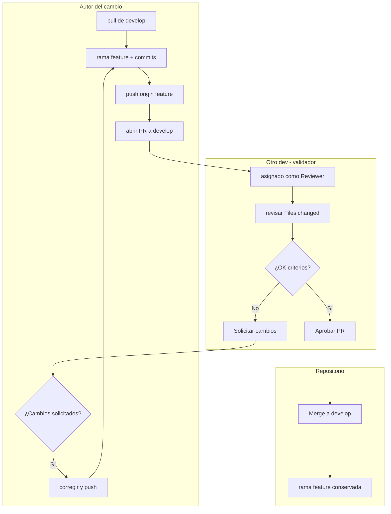

# Versionamiento y flujo de ramas — MedHospital

> **Índice:** reglas obligatorias · validación cruzada · equipo · flujo por desarrollador · rol Dev1 · GitGraph (flujo complejo) · flujo de validación (diagrama) · vista mínima · comandos útiles.

Repositorio remoto: **https://github.com/davidluna301/MedHospital**

Este repositorio incluye un **historial Git real** (varias ramas `feature/*`, `hotfix/*`, merges `--no-ff` y validaciones cruzadas descritas en los mensajes de merge) pensado para visualizar un flujo **denso** en la extensión **Git Graph** de VS Code, similar a un modelo Git Flow con `main` + `develop` + características paralelas.

## Reglas obligatorias

1. **Nunca hacer commit directamente en `main`.** La rama `main` se reserva para releases o integración final acordada con el propietario del repositorio.
2. La rama de integración continua del equipo es **`develop`**.
3. Cada integrante trabaja en una **rama de característica** (`feature/...`) creada **a partir de `develop` actualizado**.
4. Tras fusionar en `develop`, **no se elimina** la rama de característica (queda como evidencia del trabajo y del flujo).
5. **Validación cruzada obligatoria:** ningún cambio se fusiona en **`develop`** sin que **otro** miembro del equipo (distinto del autor del PR) haya **revisado y aprobado** explícitamente el Pull Request en GitHub. El autor **no** puede aprobar su propio PR. Si hay comentarios de cambio, el autor corrige y vuelve a solicitar revisión hasta obtener la aprobación.

## Validación cruzada (paso intermedio entre tu rama y `develop`)

Este paso no crea una rama Git adicional obligatoria; es una **interacción humana y de proceso** en GitHub entre el **autor** del trabajo y el **validador** (otro dev).

### Roles en cada integración

| Quién | Responsabilidad |
|--------|-----------------|
| **Autor** | Abre el PR hacia `develop`, describe cambios, responde comentarios, empuja correcciones en la misma rama `feature/...`. |
| **Validador** | Revisa código, prueba localmente si aplica, solicita cambios o **aprueba** el PR. Debe ser un compañero distinto del autor. |

### Matriz sugerida de rotación (quién valida a quién)

Evita siempre la misma pareja para repartir carga y conocimiento del código:

| Autor del PR | Validador sugerido (ejemplo) |
|--------------|------------------------------|
| Dev1 | Dev2 o Dev3 |
| Dev2 | Dev3 o Dev4 |
| Dev3 | Dev4 o Dev1 |
| Dev4 | Dev1 o Dev2 |

Cualquier otra combinación es válida siempre que **autor ≠ validador** y el validador sea del equipo del curso.

### Checklist del validador antes de aprobar

- [ ] La rama `feature/...` está actualizada con `develop` (o el PR no muestra conflictos graves).
- [ ] Los commits tienen mensajes claros en español.
- [ ] No se introducen secretos (claves, tokens) en el código.
- [ ] Criterios de aceptación de la tarea se cumplen (CRUD, plantilla, doc, etc.).

### Cómo hacerlo en GitHub

1. El autor: **Pull requests** → **New pull request** → base: **`develop`**, compare: **`feature/tu-rama`** → crear PR.
2. En la barra lateral del PR: **Reviewers** → asignar al compañero que validará (o acordar por otro canal quién valida).
3. El validador: pestaña **Files changed** → **Review changes** → **Approve** (o **Request changes**).
4. Solo con **al menos una aprobación** del validador, quien tenga permisos hace **Merge** a `develop` (squash o merge commit, según acuerdo del equipo; lo habitual académico es **merge commit** para ver el historial).

Opcional en el repositorio: **Settings → Branches → Branch protection rules** para `develop` → activar **Require a pull request before merging** y **Require approvals** (1). Así la validación queda **forzada** por GitHub, no solo por costumbre.

## Equipo y contacto

| Rol en el equipo | Usuario GitHub      | Correo institucional              |
|------------------|---------------------|-----------------------------------|
| Dev1 (repo)      | davidluna301        | david.lunamar@campusucc.edu.co    |
| Dev2             | Vanessaucc          | julieth.mena@campusucc.edu.co     |
| Dev3             | valeriaucc          | valeria.gongora@campusucc.edu.co  |
| Dev4             | BurbanoValentina    | valentina.burbanos@campusucc.edu.co |

## Flujo por cada desarrollador

### Antes de empezar (todos los devs)

```bash
git checkout develop
git pull origin develop
```

### Crear rama de trabajo

Convención sugerida: `feature/dev<numero>-<tema-corto>` en minúsculas y sin espacios.

Ejemplos:

- `feature/dev1-documentacion`
- `feature/dev2-plantillas`
- `feature/dev3-logica-citas`
- `feature/dev4-admin-y-despliegue`

```bash
git checkout -b feature/dev2-plantillas
```

### Commits (buenas prácticas)

- Mensajes en **español**, en imperativo o descriptivo claro.
- Prefijos útiles: `docs:`, `feat:`, `fix:`, `style:`, `refactor:`, `chore:`.
- Commits **pequeños y frecuentes** mejor que un solo commit gigante.
- Repartir el esfuerzo: cada dev debe aportar **varios commits** por iteración para equidad y trazabilidad.

Ejemplos:

```text
docs: ampliar sección de despliegue en README
feat(consultas): validar solapamiento de citas en formulario
fix(templates): corregir enlace del menú en móvil
```

### Subir la rama, abrir PR y pasar por validación

```bash
git push -u origin feature/dev2-plantillas
```

En GitHub: **Pull Request** con base **`develop`** (no `main`). Asignar **revisor distinto del autor**. Tras **aprobación**, merge a `develop`.

### Después del merge

- **No borrar** `feature/dev2-plantillas` en el remoto (acuerdo del equipo para evidencia académica).
- Opcional: `git checkout develop && git pull origin develop` para seguir en línea con el equipo.

## Rol de Dev1 (propietario del repo)

- Mantener **`README.md`** coherente (objetivo, instalación, diagramas, enlaces).
- Añadir remoto si el clon es nuevo:

```bash
git remote add origin https://github.com/davidluna301/MedHospital.git
```

- Primera vez: publicar `develop` y las ramas `feature/*` de evidencia (no borrar en remoto):

```bash
git push -u origin develop
git push -u origin main
git push -u origin feature/dev2-autenticacion feature/dev3-reportes feature/dev3-seed feature/dev4-pipeline feature/dev4-observabilidad hotfix/dev1-readme-typos
```

Ramas de ejemplo conservadas en remoto para evidencia en **Git Graph**: `feature/dev2-autenticacion`, `feature/dev3-reportes`, `feature/dev3-seed`, `feature/dev4-pipeline`, `feature/dev4-observabilidad`, `hotfix/dev1-readme-typos`. Los merges hacia `develop` usan `--no-ff` y los mensajes indican **quién validó** (otro dev) antes de integrar.

## Gráfico Git complejo (GitGraph)

Vista **simplificada** del tiempo con varias ramas, trabajo en paralelo, correcciones, hotfix y un cierre hacia `main` solo para **release** (el día a día del equipo sigue en `develop` y `feature/*`). Los `tag` en los `merge` recuerdan el paso de **validación por otro dev** antes de integrar.

> **Nota:** En Mermaid, los nombres de rama en `gitGraph` no deben llevar `/`; por eso se usan guiones bajos (`feature_d2_ui`). Equivale a `feature/dev2-ui` en el repositorio real.

```mermaid
gitGraph TB:
    commit id: "inicio-monorepo"
    branch develop
    checkout develop
    commit id: "bootstrap-proyecto"
    commit id: "ajuste-ci-y-lint"
    branch feature_d2_ui
    checkout feature_d2_ui
    commit id: "d2-plantillas-base"
    commit id: "d2-accesibilidad-login"
    checkout develop
    branch feature_d3_citas
    checkout feature_d3_citas
    commit id: "d3-modelo-cita"
    commit id: "d3-validacion-solape"
    checkout develop
    branch feature_d4_deploy
    checkout feature_d4_deploy
    commit id: "d4-render-y-env"
    checkout feature_d2_ui
    commit id: "d2-correccion-nav"
    checkout develop
    merge feature_d2_ui tag: "PR-merge-valido-Dev3"
    checkout feature_d3_citas
    commit id: "d3-seed-y-tests"
    checkout develop
    merge feature_d3_citas tag: "PR-merge-valido-Dev1"
    checkout develop
    merge feature_d4_deploy tag: "PR-merge-valido-Dev2"
    branch chore_audit_log
    checkout chore_audit_log
    commit id: "d4-trazas-y-log"
    commit id: "d4-tests-vistas"
    checkout develop
    merge chore_audit_log tag: "PR-chore-valido-Dev3"
    branch feature_d2_i18n
    checkout feature_d2_i18n
    commit id: "d2-mensajes-es"
    checkout develop
    merge feature_d2_i18n tag: "PR-i18n-valido-Dev1"
    branch hotfix_d1_typo
    checkout hotfix_d1_typo
    commit id: "d1-hotfix-readme"
    checkout develop
    merge hotfix_d1_typo tag: "hotfix-valido-Dev4"
    branch feature_d1_docs
    checkout feature_d1_docs
    commit id: "d1-readme-y-ER"
    commit id: "d1-versionamiento-md"
    checkout develop
    merge feature_d1_docs tag: "PR-docs-valido-Dev2"
    checkout main
    merge develop tag: "release-1.0-validacion-equipo"
```



Interpretación rápida de la complejidad del grafo:

- **`develop`** concentra la integración continua.
- **Varias `feature_*` en paralelo** (Dev2 UI, Dev3 citas, Dev4 deploy) simulan solapamiento real de sprints.
- **Commits extra en una feature** (`d2-correccion-nav`) simulan iteración tras revisión (“request changes”).
- **`hotfix_*` desde `develop`** muestra un arreglo pequeño validado aparte.
- **`chore_*` y segunda oleada `feature_*`** muestran integraciones adicionales tras el primer bloque de PRs.
- **Último merge a `main`** solo como **release** acordado, no como flujo diario.

## Flujo de validación (interacción entre devs)

Este diagrama es el **paso intermedio** explícito entre “subo mi rama” y “los cambios están en `develop`”:



## Resumen visual mínimo (texto)

```text
main          (solo release acordado; sin trabajo diario directo)
  ^
  |   merge con tag / revisión de release
  |
develop  <---- pull antes de cada nueva rama; merges solo con PR aprobado por OTRO dev
  ^
  |   merge PR (tras revisión y aprobación)
  |
feature/devX-tarea
```

## Comprobar estado

```bash
git status
git log develop --oneline -15
git branch -a
```
MedHospital - trazabilidad Git (extension Git Graph)
